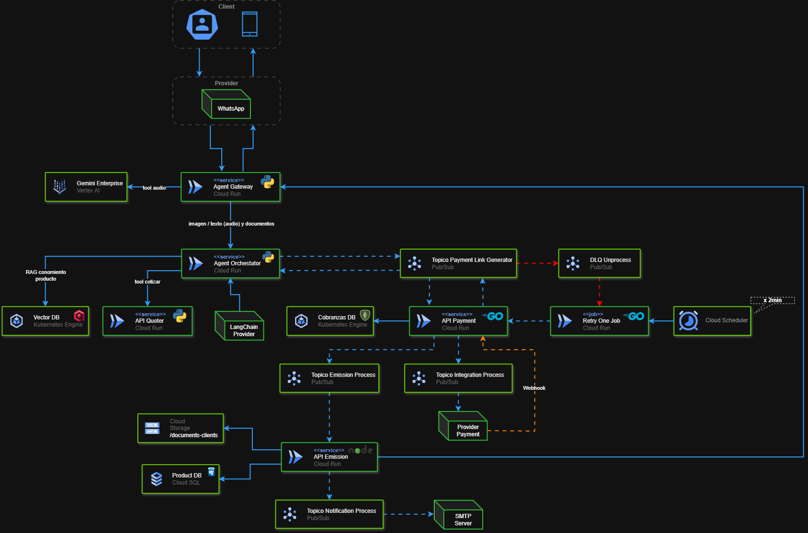
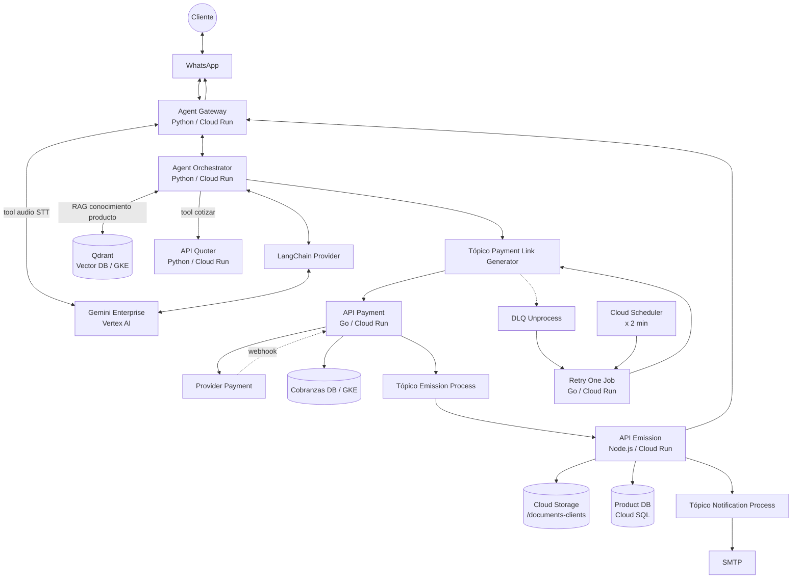
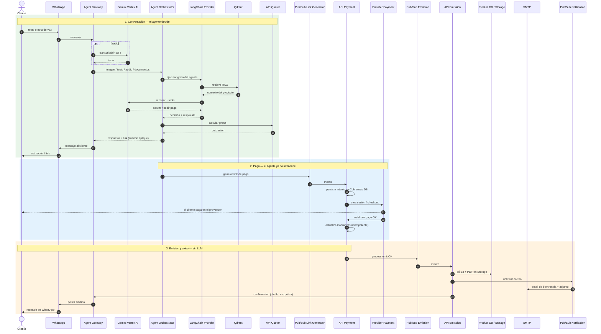
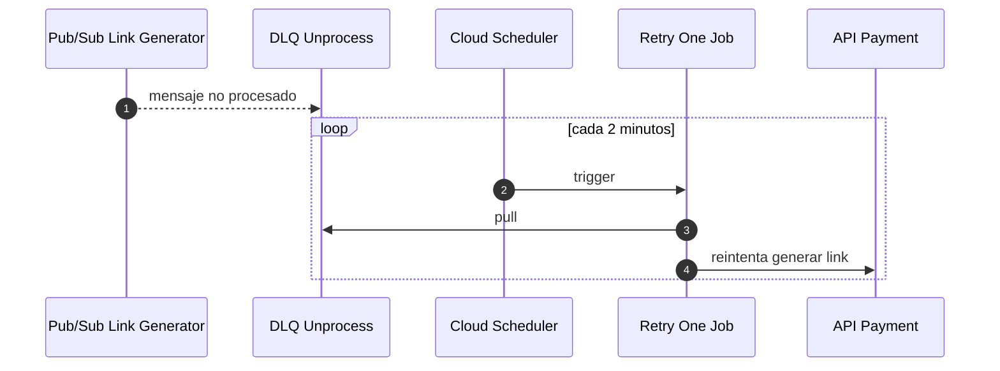

# Sistema Agéntico para Ventas Asistidas

**Abrir en el navegador:** [`entregable-tarea-wcdz.html`](entregable-tarea-wcdz.html) (con internet, para que Mermaid dibuje los diagramas). Este README es el mismo contenido en texto.

**Autor:** William Elisban Chávez Díaz  
Documento de **propuesta** (plan, no implementación).

**Empresa:** Aseguradora Chanchito Feliz  
**Producto:** Inversión Segura (ahorro / devolución)  
**Canal hoy:** WhatsApp atendido por asesores humanos  
**Horario asistido:** lun–vie 9:00–18:00 · sábados hasta mediodía

**Región de costeo:** `us-central1` · agosto 2026  
**Calculadora:** [Google Cloud Pricing Calculator](https://cloud.google.com/products/calculator)  
**Tokens:** [Vertex AI Generative AI pricing](https://cloud.google.com/vertex-ai/generative-ai/pricing) · sin input cache

---

## El problema

La venta asistida de Inversión Segura se corta cuando no hay asesor.

**Aseguradora Chanchito Feliz** vende **Inversión Segura** por WhatsApp. El canal ya existe, pero la atención la sostienen **pocos asesores de ventas**. El cliente que escribe fuera de turno no compra: espera o agenda una llamada. Esa fricción es la que se quiere romper para subir ventas.

| | |
|---|---|
| **Fricción** | Pocos asesores. Si todos están ocupados, el cliente agenda una llamada o se queda en espera. |
| **Ventana** | Lunes a sábado mediodía. Noche, domingo y feriado se pierden. |
| **Meta** | Atender, cotizar y cerrar cuando el cliente escribe, no cuando se libera un asesor. |

El WhatsApp actual no escala. Depende de una persona en un horario de oficina. El cliente que quiere resolver dudas, enviar su DNI o pagar un domingo no tiene con quién hablar. La venta se aplaza o se pierde.

---

## Propuesta

Un agente que acompaña la venta de punta a punta.

No es un chatbot de respuestas fijas. Es un **asesor digital en WhatsApp** que **acompaña todo el flujo de venta end to end** y **guarda el estado** de cada conversación: en qué va el cliente, qué datos ya entregó, qué plan cotizó y si ya pagó o se emitió. Entiende texto, voz, imagen y documentos. El cobro y la emisión **no los ejecuta el LLM**: el agente los orquesta y luego sigue leyendo ese estado.

1. **Asesor de producto.** Resuelve dudas de Inversión Segura con conocimiento (RAG), no con un menú rígido.
2. **Recopila información del cliente.** Nombre, datos de contacto y lo que haga falta para cotizar y emitir.
3. **Lee imágenes.** Captura DNI o el rostro cuando el cliente los manda por el chat.
4. **Lee documentos y audios.** Condicionado, constancias o una nota de voz: el gateway transcribe y el orquestador entiende.
5. **Cotiza y gestiona planes.** Elige la tool de cotización y presenta primas y periodos.
6. **Acompaña el cierre y el después.** Pide el link; el webhook cobra; Emission documenta y avisa. El agente **guarda el estado** en cada paso. Si el cliente vuelve (“¿ya salió mi póliza?”), retoma desde ahí: no empieza de cero ni vuelve a emitir.

| Rubro | USD / mes (MVP 1 000 conversaciones) |
|---|---:|
| Total MVP | **$96 – 110** |
| Cloud GCP | $36 – 49 |
| Gemini 2.5 Flash (in/out, sin cache) | ~$60 |

**Regla de diseño:** el agente **acompaña el flujo completo** (duda → datos → cotizar → pagar → emitir → post-compra) y **persiste el estado**. El LLM conversa y pide el link. El webhook cobra. Emission documenta. El agente no cobra ni emite: **lee y actualiza estado**.

---

## El sistema agéntico, por capas

Ocho capas. El cerebro decide; las tools calculan; el cierre es un pipeline de eventos. Ninguna capa hace el trabajo de otra.

| Capa | Componente | Rol |
|---|---|---|
| Canal | WhatsApp + Agent Gateway (Python, Cloud Run) | Entra/sale el mensaje. STT con Gemini si hay voz. |
| Cerebro | Agent Orchestrator (Python, Cloud Run) + **LangChain Provider** | Acompaña el flujo end to end. Guarda estado, intención, memoria y tool-calling. |
| Conocimiento | Qdrant (Vector DB, GKE) | RAG: condicionado, FAQs y producto de Chanchito Feliz. |
| Modelo | Gemini Enterprise (Vertex AI) | STT en el Gateway; razonamiento vía LangChain en el orquestador. |
| Tool cotizar | API Quoter (Python, Cloud Run) | Primas y periodos. |
| Tool pagar | API Payment (Go, Cloud Run) + proveedor | Link de pago; webhook de confirmación. |
| Cierre | API Emission (Node.js, Cloud Run) | Póliza, PDF, correo. El agente no participa. |
| Aviso | Gateway + SMTP | WhatsApp al cliente y email de bienvenida. |

Flujo de negocio:

```text
Conversar / cotizar          →  Orchestrator + LangChain + Gemini + Quoter + Qdrant
Pedir link de pago           →  Pub/Sub Payment Link Generator → API Payment
Cliente paga en el proveedor →  Webhook → API Payment → Cobranzas DB
Emitir póliza                →  Pub/Sub Emission Process → API Emission
Avisar                      →  Gateway (WhatsApp) + SMTP (correo)
```

---

## Diagrama lógico de componentes

Arquitectura objetivo (TO-BE) en GCP. Imagen de diseño:



### 2.1 Lectura del diagrama

- **Verde:** servicios Cloud Run y datos.
- **Naranja punteado:** webhook del proveedor de pago hacia API Payment.
- **Rojo punteado:** DLQ + *Retry One Job* (Scheduler cada 2 min) si falla la generación del link.
- El orquestador **no** se conecta al tópico de emisión.
- **LangChain Provider** cuelga del orquestador: es el runtime del agente (tools, memoria, RAG). Gemini en el Gateway es STT (`tool audio`); Gemini detrás de LangChain es el LLM de razonamiento.

### 2.2 Vista Mermaid (misma arquitectura)



### 2.3 Responsabilidades

| Componente | Tecnología | Qué hace |
|---|---|---|
| Agent Gateway | Python, Cloud Run | WhatsApp ↔ sistema. STT. Aviso final al cliente. |
| Agent Orchestrator | Python, Cloud Run | Decide cotizar o pedir link. Delega el grafo a LangChain. **No emite.** |
| LangChain Provider | Framework del agente | Tools, memoria y llamadas a Gemini. |
| Qdrant | Vector DB, GKE | Fuente de conocimiento (RAG). |
| API Quoter | Python, Cloud Run | Cálculo de cotización. |
| API Payment | Go, Cloud Run | Link, webhook, Cobranzas. Publica emisión si `paid`. |
| Provider Payment | Externo | Checkout. Confirma por webhook. |
| API Emission | Node.js, Cloud Run | PDF, Cloud SQL, Storage, SMTP, avisa al Gateway. |
| Pub/Sub | GCP | Desacopla link, emisión y notificación. |
| DLQ + Retry + Scheduler | Go / Cloud Run | Reintenta fallos de generación de link. |

---

## 3. Diagrama de secuencia (historia completa)

Pensado para que se vea **quién habla con quién** y **por qué el agente no emite**.



### 3.1 Secuencia de reintento (si falla el link)



El retry **no** reprocesa el webhook. El webhook debe ser idempotente: el mismo `transactionId` no emite dos pólizas.

---

## 4. Estimación de costos

Precios de **lista** (sin CUD). **No se considera input cache.** Hipótesis MVP: 1 000 conversaciones / mes, 12 mensajes c/u, 1,8 invocaciones LLM por mensaje, 20 % voz (15 s), 5 % de cierre (50 emisiones).

### 4.1 Cloud (calculadora GCP)

Tarifas Cloud Run request-based `us-central1`: $0.000024 / vCPU-s · $0.0000025 / GiB-s · $0.40 / M requests.  
Free tier (por cuenta): 180 000 vCPU-s, 360 000 GiB-s, 2 M requests.

| Servicio | Requests/mes | Duración | vCPU | Mem | vCPU-s | GiB-s |
|---|---:|---:|---:|---:|---:|---:|
| Agent Gateway | 12 000 | 5 s | 1 | 0,5 | 60 000 | 30 000 |
| Agent Orchestrator | 21 600 | 4 s | 1 | 0,5 | 86 400 | 43 200 |
| API Quoter | 2 000 | 8 s | 1 | 1,0 | 16 000 | 16 000 |
| API Payment | 250 | 2 s | 1 | 0,5 | 500 | 250 |
| API Emission | 50 | 45 s | 1 | 1,0 | 2 250 | 2 250 |
| **APIs** | | | | | **~165 150** | **~91 700** |

Las APIs caen en el free tier de compute y requests → **≈ $0**.

| Concepto | Cálculo | USD / mes |
|---|---|---:|
| WAHA / Gateway caliente (min instance 1, 1 vCPU + 1 GiB, 730 h) | 2 × 2 628 000 × $0.0000025 | 13,14 |
| Cloud Storage ~5 GB documentos | $0.020 / GB; 5 GB Always Free | 0,00 – 0,10 |
| Artifact Registry ~2 GB | 0,5 GB free + GiB-hora | ~0,15 |
| Cloud Build 20 × 10 min | 2 500 min free | 0,00 |
| Cloud Logging ~8 GiB | 50 GiB free / proyecto | 0,00 |
| Pub/Sub (volumen MVP) | mensajes de link / emisión / notify | ~0,10 |
| GKE Qdrant + Cobranzas (nodo e2-small aprox.) | estimado lista | ~15 – 25 |
| Cloud SQL Product DB (db-f1-micro) | estimado lista | ~8 – 10 |
| **Subtotal cloud MVP** | | **≈ 36 – 49** |

> En un MVP “solo Cloud Run + WAHA encendido” (sin GKE/SQL) el cloud baja a **~$14**. El rango de arriba incluye Qdrant, Cobranzas y Product DB del diagrama TO-BE. Reproducir en la [calculadora](https://cloud.google.com/products/calculator): Cloud Run, Cloud Storage, Artifact Registry, Pub/Sub, GKE, Cloud SQL.

### 4.2 Modelos de IA (tokens, sin cache)

**Gemini 2.5 Flash** Standard (Vertex AI):

| Modalidad | USD / 1 M tokens |
|---|---:|
| Input texto | 0,30 |
| Input audio | 1,00 |
| Output (respuesta + reasoning) | 2,50 |

Fuente: [pricing Vertex AI](https://cloud.google.com/vertex-ai/generative-ai/pricing).

Por invocación del orquestador (promedio, sin cache): **4 000 tokens in** · **600 tokens out**.

| Flujo | Tokens / mes | Cálculo | USD / mes |
|---|---:|---|---:|
| Input agente | 21 600 × 4 000 = 86,4 M | × $0,30 | 25,92 |
| Output agente | 21 600 × 600 = 12,96 M | × $2,50 | 32,40 |
| Input audio STT | 2 400 × 15 s × 32 = 1,15 M | × $1,00 | 1,15 |
| Output STT | 2 400 × 80 = 0,19 M | × $2,50 | 0,48 |
| **Total IA** | | | **≈ 59,95** |

```text
USD_IA = (invocaciones × 4000 / 1e6) × 0.30
       + (invocaciones ×  600 / 1e6) × 2.50
       + (audios × 15 × 32 / 1e6) × 1.00
       + (audios × 80 / 1e6) × 2.50

invocaciones = conversaciones × 12 × 1,8
audios       = conversaciones × 12 × 0,20
```

### 4.3 Resumen

| Rubro | USD / mes (MVP 1 000 conversaciones) |
|---|---:|
| Cloud (Run + WAHA + datos del TO-BE) | ~36 – 49 |
| Gemini 2.5 Flash (in/out, sin cache) | ~60 |
| **Total** | **≈ 96 – 110** |

| Conversaciones / mes | Cloud (aprox.) | IA (aprox.) | Total |
|---:|---:|---:|---:|
| 1 000 | 40 | 60 | **~100** |
| 5 000 | 70 | 300 | **~370** |
| 10 000 | 90 | 600 | **~690** |

Escalar usuarios encarece sobre todo **el output del modelo**, no Cloud Run. El agente no se invoca en el webhook ni en la emisión: eso mantiene el costo de tokens acotado al chat.

---

## Conclusión

Hoy Inversión Segura se vende por WhatsApp solo cuando hay un asesor libre, en horario de oficina. La propuesta cierra esa brecha: un **agente que acompaña la venta end to end y guarda el estado** (Gateway + Orchestrator + **LangChain** + Gemini + Qdrant + Quoter) y un **pipeline de cierre sin LLM** (Payment con webhook → Emission → correo y WhatsApp). El cliente puede irse y volver: el agente retoma, no reinicia.

El diagrama de componentes (imagen + Mermaid) muestra el mapa. El diagrama de secuencia muestra el orden temporal: primero decide el agente, después cobra el proveedor, al final emite y avisa el sistema.
