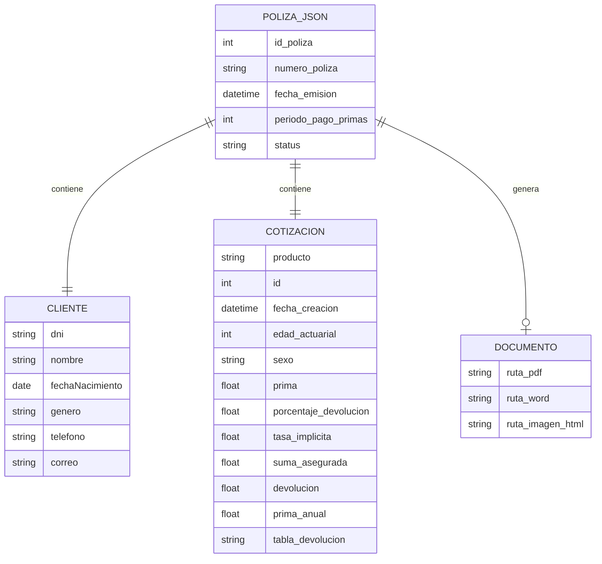

# Bases de datos

## Información General

RumbIA no usa un motor relacional en los repos propios. El backend persiste cada póliza como un archivo JSON en el directorio `rumbia-backend/db/`, con nombre `RumbIA{id:03d}.json`. El cotizador mantiene cotizaciones y caches en memoria de proceso; las imágenes JPEG se escriben en `rumbia-cotizador/db/`. Los documentos generados (Word, PDF, JPEG del correo) viven en `rumbia-backend/db/documentos/`.

La fuente de conocimiento conversacional es **Qdrant** (vector DB / RAG), consumida por el `llm-api` externo. No hay cliente Qdrant en `waha_gateway`, `rumbia-backend` ni `rumbia-cotizador`.

Esta persistencia es suficiente para el MVP (emisión secuencial y regeneración de documentos desde el JSON). No hay transacciones ni consultas relacionales.

## Diagrama de Base de Datos

## Descripción de Tablas

| Tabla | Descripcion | Proposito Principal |
|---|---|---|
| POLIZA_JSON (`db/RumbIA###.json`) | Archivo JSON por póliza emitida; el ID se calcula como `max(existentes) + 1` | Fuente de verdad de la emisión y entrada para regenerar documentos |
| CLIENTE (objeto anidado) | DNI, nombre, nacimiento, género, teléfono y correo | Identificar al asegurado y destinos de email/WhatsApp |
| COTIZACION (objeto anidado) | Producto Rumbo, parámetros actuariales, prima, suma, tabla de devolución | Reproducir el cálculo vendido en el condicionado |
| DOCUMENTO (`db/documentos/`) | PDF/Word del condicionado y JPEG del HTML de bienvenida | Adjuntos de correo y paquete WhatsApp |
| CACHE_COTIZADOR (memoria) | Hash MD5 de edad/sexo/prima/periodo → resultado Excel | Evitar reabrir el libro xlwings en cotizaciones repetidas |
| QDRANT (vector DB, fuera del workspace) | Colecciones de embeddings del producto Rumbo | Contexto RAG para el agente LangChain |

## Relaciones Principales

- Una póliza tiene exactamente un cliente y una cotización embebidos en el mismo JSON.
- El número de póliza `RumbIA###` es la clave de negocio y el prefijo de los archivos de documento (`RumbIA001_Condicionado_Particular.pdf`, `RumbIA001_email.jpg`).
- El teléfono del cliente, normalizado a `51…`, se convierte en `chatId` `{numero}@c.us` al hablar con WAHA.
- El correo del cliente es el destinatario SMTP.
- El cotizador no comparte almacenamiento con el backend: la pasarela reenvía los campos de cotización en el POST de emisión.
