## /waha/webhook

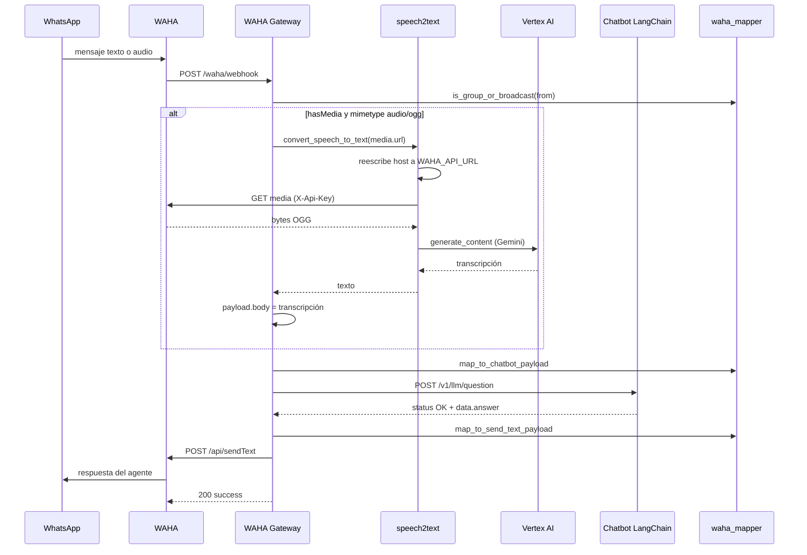

## /api/v1/rumbia/emision-poliza

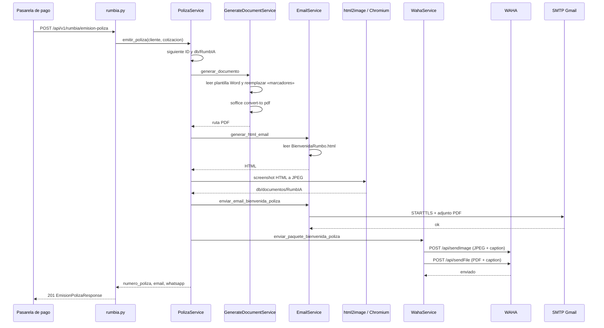

## /api/v1/cotizaciones

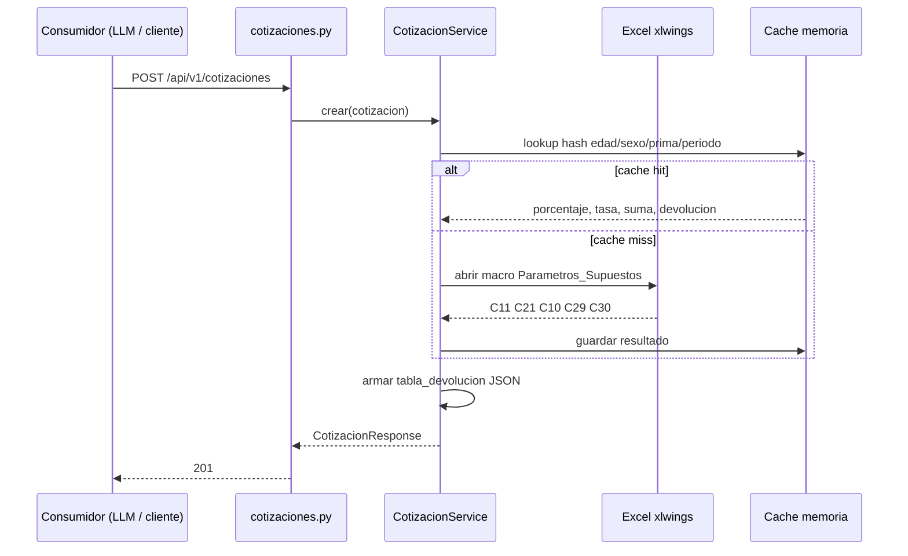

## /api/v1/cotizaciones/coleccion

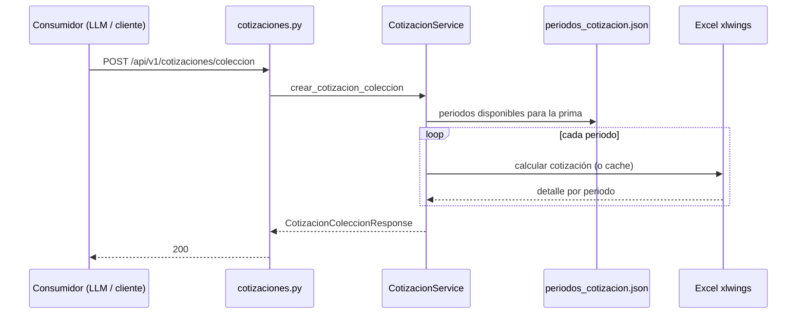

## /api/v1/cotizaciones/generar-imagen

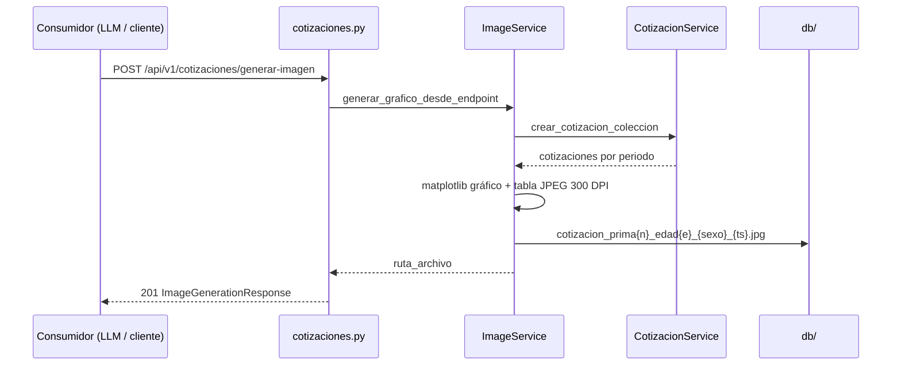

## /api/v1/cotizaciones/cache

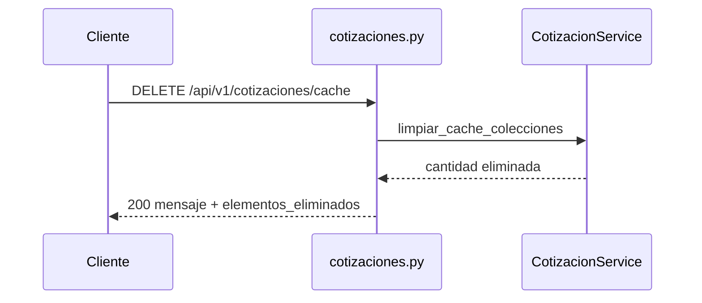

## /api/v1/cotizaciones/cache/estadisticas

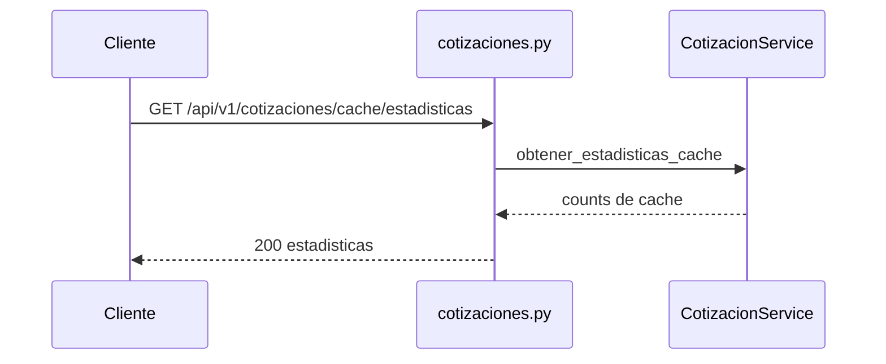

## /api/v1/rumbia/saludo

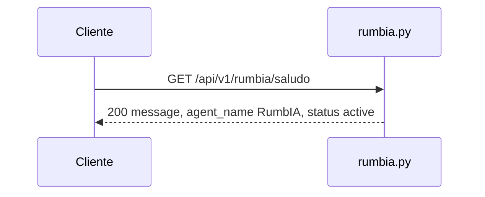

## /api/v1/rumbia/

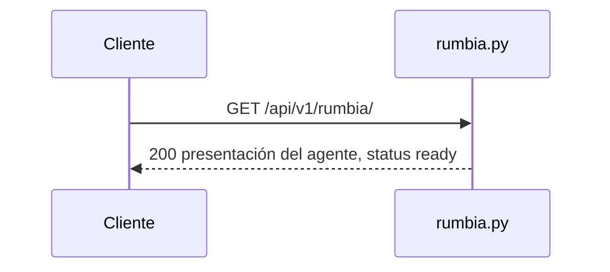

## /api/v1/rumbia/health

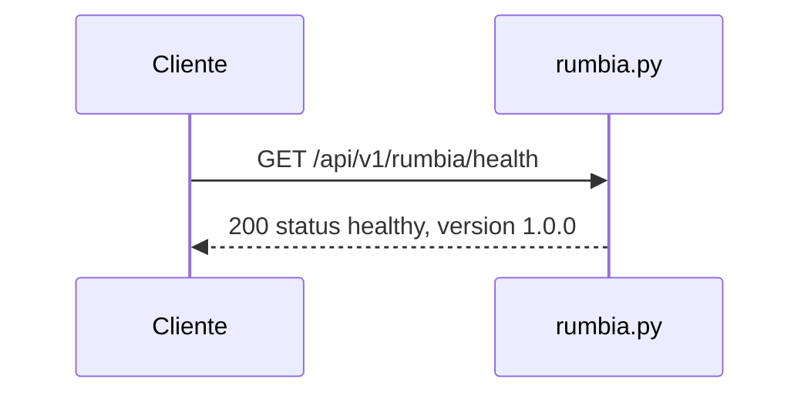

## /api/v1/rumbia/info

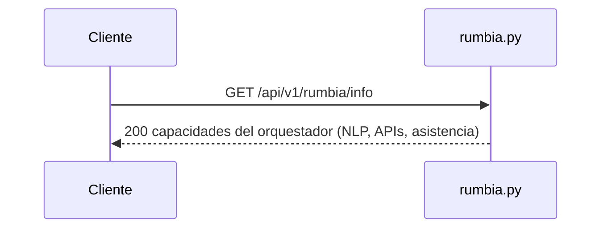

## /health

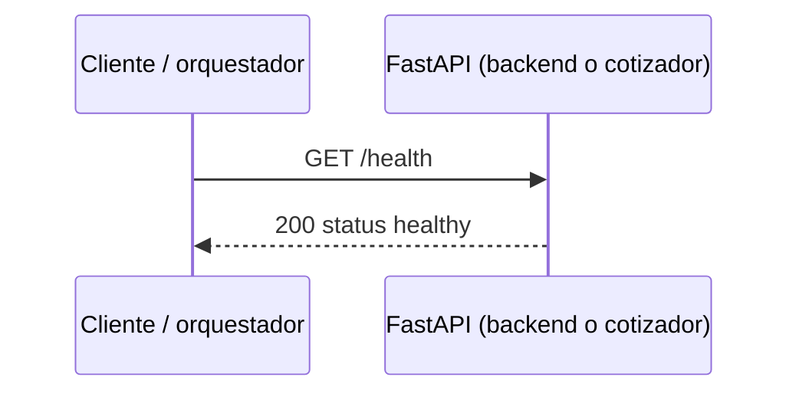

## /

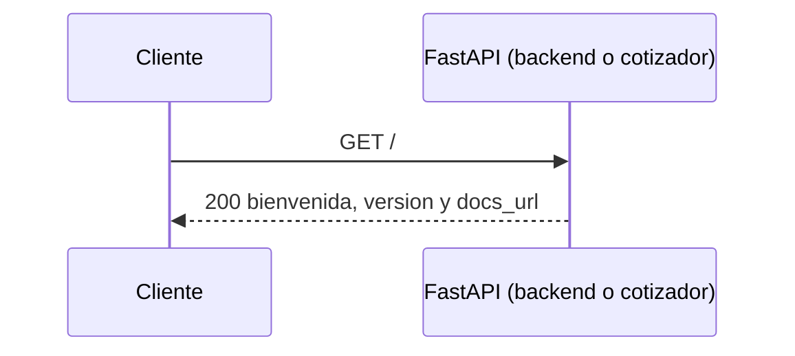
